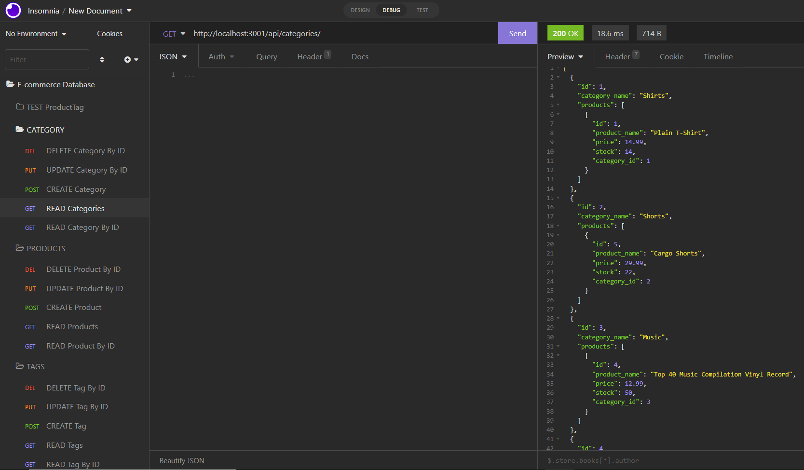

# sequelize-e-commerce-back-end

Bootcamp Week13: Homework

# 13 Object-Relational Mapping (ORM): E-Commerce Back End

## Table of Contents 

- [About Task](#about-task)
- [User Story](#user-story)
- [Getting Started](#getting-started)
- [Database Models](#database-models)
- [My Solution](#my-solution)
- [Walkthrough Video](#walkthrough-video)

## About Task

Internet retail, also known as **e-commerce**, is the largest sector of the electronics industry, generating an estimated $29 trillion in 2019. For understanding the fundamental architecture of e-commerce platforms, my task is to build the back end for an e-commerce site by modifying the starter code, uses the following technologies:

  * Connects to a MySQL database using the [MySQL2](https://www.npmjs.com/package/mysql) and [Sequelize](https://www.npmjs.com/package/sequelize) packages.

  * Stores sensitive data, like a user’s MySQL username, password, and database name, using environment variables through the [dotenv](https://www.npmjs.com/package/dotenv) package.

  * Syncs Sequelize models to a MySQL database on the server start.

## User Story

```md
AS A manager at an internet retail company
I WANT a back end for my e-commerce website that uses the latest technologies
SO THAT my company can compete with other e-commerce companies
```

## Getting Started

This application uses the [MySQL2](https://www.npmjs.com/package/mysql2) and [Sequelize](https://www.npmjs.com/package/sequelize) packages to connect the Express.js API to a MySQL database and the [dotenv](https://www.npmjs.com/package/dotenv) package to use environment variables to store sensitive data. It is required to install all necessary dependencies.

- First clone the repository
- Rename `.env.example` to `.env` and then add your values for each environment variable in the file
- `npm i`             // to install the dependencies
- Make sure Database (MySQL) server is started (see Hint!)
- `npm run seed`      // if applicable
- `nmp start`         // to invoke the application

> **Hint:** Run the following commands in the `db` folder to create your database with MySQL shell:

```
mysql -u root -p // with password
source schema.sql
source seeds.sql
quit
```

## Database Models

The database name: `ecommerce_db` contains the following four tables:

- Category
- Product
- Tag
- Product Tag  (connection table between Product and Tag tables)

The database structure is shown in the following image:


### Associations

The Sequelize models execute the following relationships using association methods:

* `Product` belongs to `Category`, and `Category` has many `Product` models, as a category can have multiple products but a product can only belong to one category.

* `Product` belongs to many `Tag` models, and `Tag` belongs to many `Product` models. Allow products to have multiple tags and tags to have many products by using the `ProductTag` through model.

> **Note:** The foreign key relationship setup is important in the respective models. It was the challenging part of this task. (see in the index.js file in models directory)

## My Solution

This application is invoked after the database is created and seeded with test data. Once your server is started and the Sequelize models are synced to the MySQL database, you can see the results in Insomnia.

In `models` directory, the all table relationship models are defined using association method in `index.js` file. Also, I created the Sequelize models for all four tables used in the application: `Category.js`, `Product.js`, `Tag.js`, and `ProductTag.js`. 

In `routes` directory, the API routes are defined for categories, products, and tags: `product-routes.js`, `tag-routes.js`, and `category-routes.js`. The data for each of these routes is displayed in a formatted JSON.

**Note** The functionality for creating the many-to-many relationship for products has already been completed in the starter code.

After the Sequelize models and API routes were created, the CRUD operations needs to created for each model using its own routes. To successfully read, create, update, and delete data in the database, the following options are created in Insomnia:

-  the application's GET routes to return all categories, all products, and all tag: “GET tags,” “GET Categories,” and “GET All Products.”.

- the application's GET routes to return a single category, a single product, and a single tag: “GET tag by id,” “GET Category by ID,” and “GET One Product.

- the application's POST, PUT, and DELETE routes for categories: “DELETE Category by ID,” “CREATE Category,” and “UPDATE Category.

The following scheme illustrates Category, Product, and Tag data being tested in Insomnia.

```
Insomnia
|
E-Commerce Database
|
├── CATEGORY                         // full route: http://localhost:3001/api/categories/
│   ├── GET   READ Categories"               
│   ├── GET   READ Category By ID"    
│   ├── POST  CREATE Category               
│   ├── PUT   UPDATE Category By ID"               
│   └── DEL   DELETE Category By ID"
├── PRODUCT                          // full route: http://localhost:3001/api/products/
│   ├── GET   READ Products              
│   ├── GET   READ Product By ID   
│   ├── POST  CREATE Product               
│   ├── PUT   UPDATE Product By ID               
│   └── DEL   DELETE Product By ID
├── TAG                              // full route: http://localhost:3001/api/tags/
│   ├── GET   READ Tags              
│   ├── GET   READ Tag By ID   
│   ├── POST  CREATE Tag               
│   ├── PUT   UPDATE Tag By ID               
│   └── DEL   DELETE Tag By ID
└──Test ProductTag                   // full route: http://localhost:3001/api/producttags/
    └── GET   READ All ProductTag
```

> **Note**: For testing purpose, I added `producttag-routes.js` and GET - READ all ProductTag method in the application. (full route: http://localhost:3001/api/producttags/) 

The following image shows how to see the application's results in Insomnia. The database CRUD operation options are separated in each models. 



## Walkthrough Video

The following walkthrough videos demonstrate the CRUD operations functionality in database using Insomnia app. 

Walkthrough Video - on Youtube:

- [E-Commerce Back-End (Part 1)](https://youtu.be/zRv3rdXQ_Mk) CRUD operations functionality in CATEGORY and PRODUCT tables 
- [E-Commerce Back-End (Part 2)](https://youtu.be/nGkjvkG7fVo) CRUD operation functionality in TAG table 

If you have any questions about the repo, open an issue or contact me directly at naraamtm@gmail.com. Here is a link to this application repo on [Github: sequelize-e-commerce-back-end](https://github.com/Nara1469/sequelize-e-commerce-back-end).